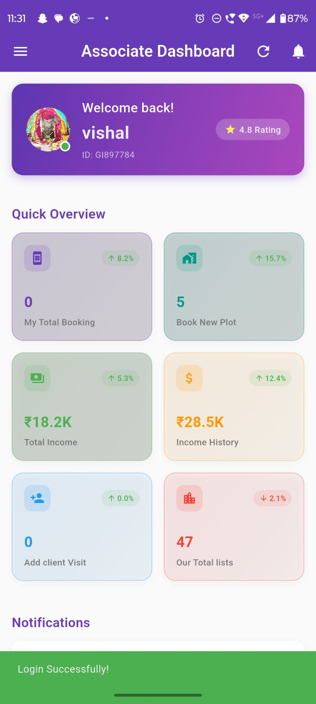
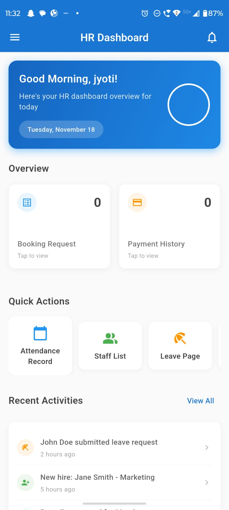
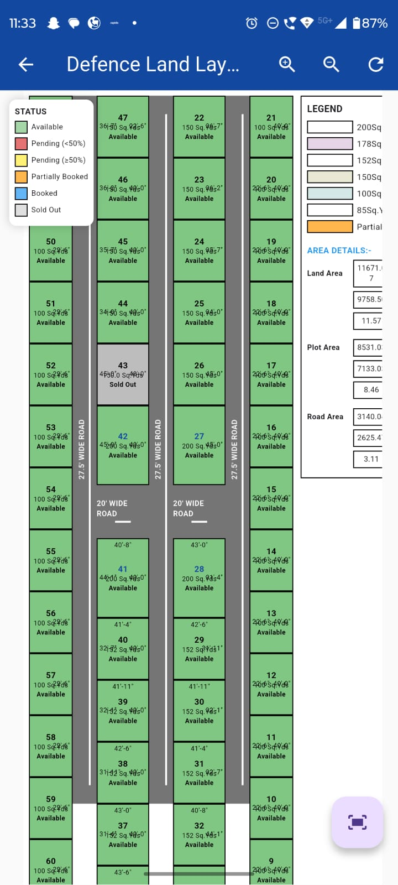
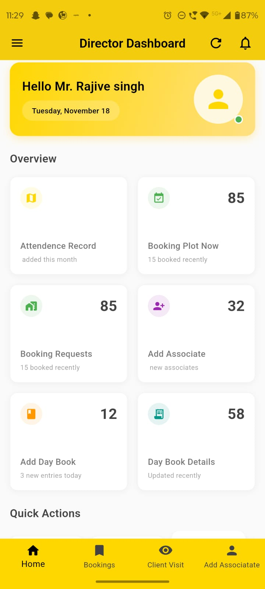

# 🏡 New Urban Homes – Real Estate & Plot Booking Mobile App  
New Urban Home is a complete real-estate management application built using Flutter, designed to handle plots, bookings, HR operations, associates, payments, and dashboards with real-time updates. It integrates secure REST APIs and follows MVVM architecture for clean and scalable development.

---

## 📱 App Modules Included
- **Associate Module**
- **HR Module**
- **Director Module**
- **Plot Map Viewer (Interactive)**

---

## 🚀 Key Features

### 🔷 Customer / Associate Features
- Real-time plot status (Available / Pending / Booked / Sold)
- Plot booking system
- Booking history
- Income dashboard
- Client visit tracking

### 🔷 HR Features
- Attendance management
- Staff list & leave management
- Daily activity tracking
- Payment & booking monitoring

### 🔷 Director/Admin Features
- Full analytics dashboard
- Associate management
- Booking approvals
- Day book & business reports

### 🔷 Plot Map Module
- Full colony layout
- Color-based status legend
- Real-time update on each plot
- Zoom & highlight feature

---

## 🧱 Tech Stack

| Component | Technology |
|----------|------------|
| Framework | Flutter |
| State Management | Provider / GetX |
| API Handling | Dio + Interceptors + Token Auth |
| Backend | .NET Core |
| Database | SQL Server |
| Architecture | Clean + MVVM |

---

## 📸 App Screenshots

### 🔹 1. Associate Dashboard



### 🔹 2. HR Dashboard



### 🔹 3. Colony Plot Layout (Interactive Map)



### 🔹 4. Director Dashboard



---

## ⚙️ Running the App

```bash
flutter pub get
flutter run
